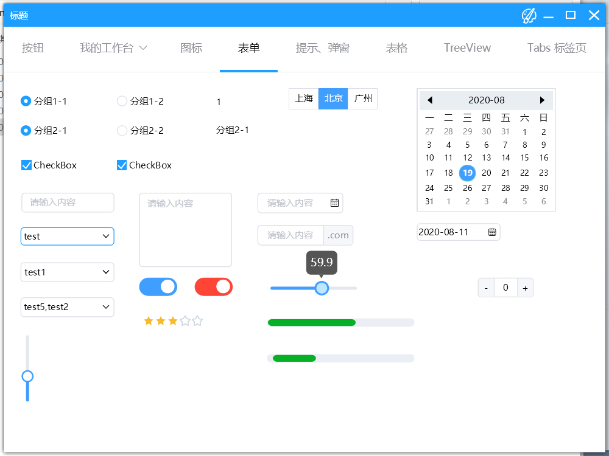
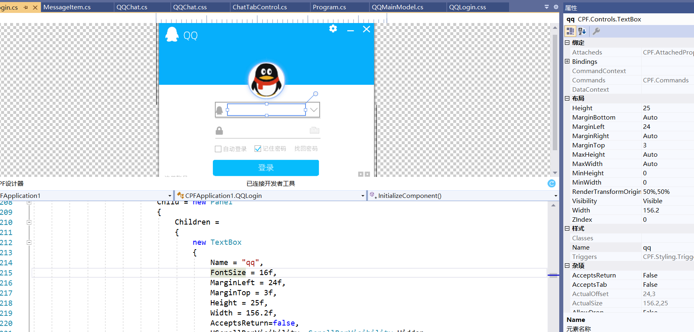
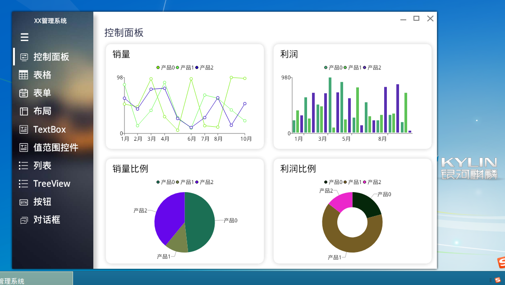
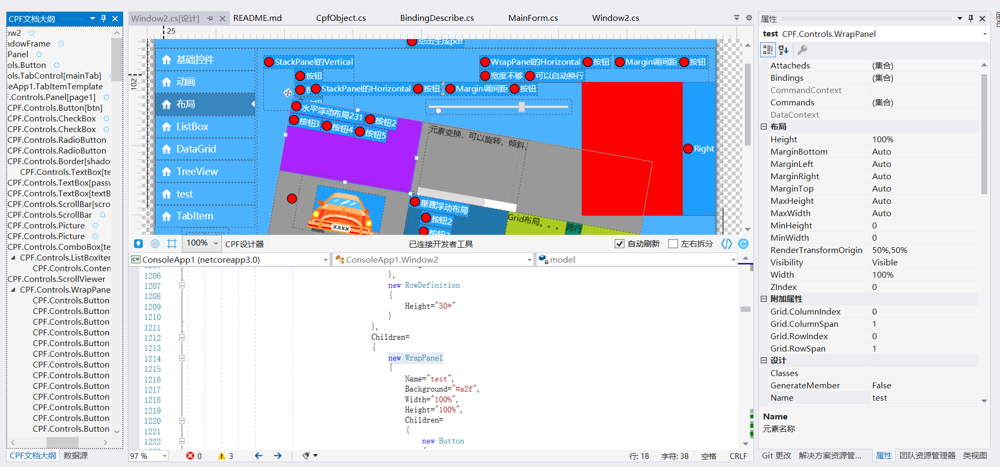
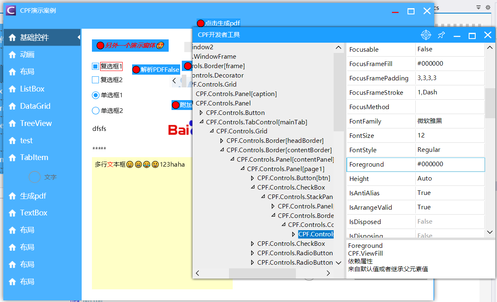

# CPF

#### 介绍
C#跨平台UI框架

提供NETStandard2.0和net4的库，通过Netcore可以跨平台，支持Windows、Mac、Linux，Net4的可以支持XP。各个平台运行效果一致，不依赖系统控件。
支持窗体，控件任意透明，支持异形窗体，支持SVG图标显示。
支持动画，数据绑定，Mvvm模式，CSS等，简化依赖属性，数据绑定的写法，提供数据上下文和命令上下文来绑定，直接用CSS和C#代码描述。
提供设计器生成C#代码和开发者工具查看和调试元素
和WPF一样的理念，任何控件都可以任意设计模板来实现各种效果
除了使用平台相关API之外，基本可以实现一次编写，到处运行
全面支持国产化，支持国产Linux + 龙芯、飞腾、兆芯、海光等CPU平台

 Apache License 2.0

#### 软件架构
软件架构说明

CPF为主要框架，CPF.Skia为用skia做图形适配，CPF.Windows、CPF.Linux、CPF.Mac、CPF.Android为各个平台的适配器

#### 使用说明

直接克隆/下载就可以编译，直接启动ConsoleApp1看运行效果

CPF使用文档 http://cpf.cskin.net/Course/#/

#### 关于设计器

设计器不开源，设计器是需要另外收费的，免费模式可以刷新和预览，不能拖拽和审查元素，可以免费试用VIP一个月
更多详细内容可以到 http://cpf.cskin.net/ 

#### 参与贡献

打赏/捐赠

微信/支付宝

1.  Fork 本仓库
2.  新建 Feat_xxx 分支
3.  提交代码
4.  新建 Pull Request

QQ群：894952004
